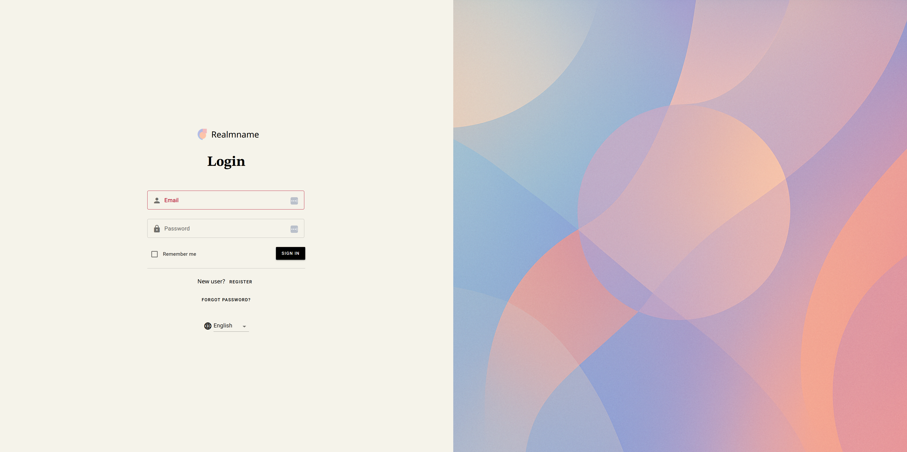
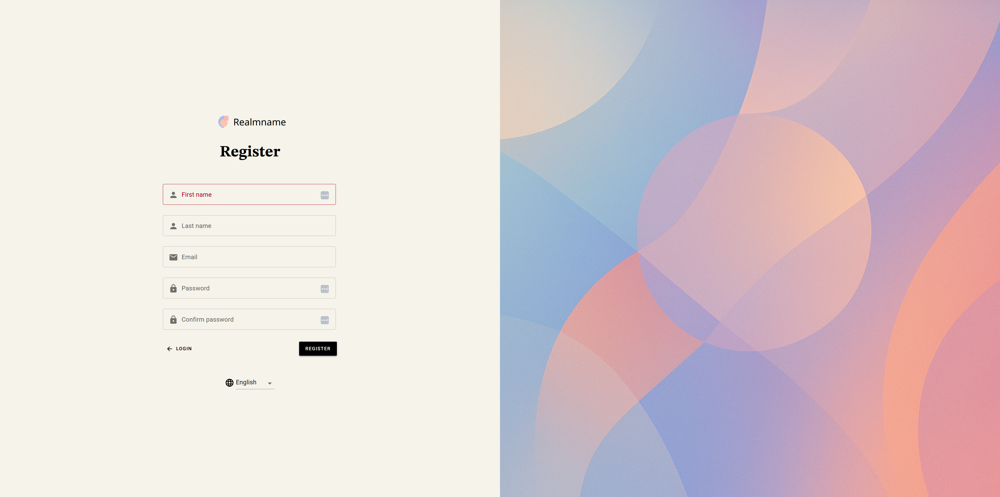

# Custome Material Keycloak-Theme
A Keycloak theme based on Material Design and Repository [material-keycloak-theme](https://github.com/MAXIMUS-DeltaWare/material-keycloak-theme/tree/master) by MAXIMUS-DeltaWare

## Overview

This is a **complete** Keycloak login theme, based on [Material Design](https://material.io/design/).  The theme uses the [Material Web Components library](https://material.io/develop/web/) for UI controls.  Currently, this theme styles the "login", "register", and "forgot password" screens.  More layouts may be included in the future depending on demand.

This repository is based on the Repository [material-keycloak-theme](https://github.com/MAXIMUS-DeltaWare/material-keycloak-theme/tree/master) by MAXIMUS-DeltaWare. I've added design features and fixed bugs happens in firefox browser.

## Installation

1. Download or clone this repository
2. Copy the `material-custom-theme` directory in this repository to `<your-keycloak-installation>/themes/material` (find `docker-compose.yml` with start command at the bottom)
3. Start or restart your Keycloak server.
4. Log into your Keycloak server's Administration Console.  Select the `material-custom-theme` theme by navigating to Realm Settings → General → Themes → Login Theme.